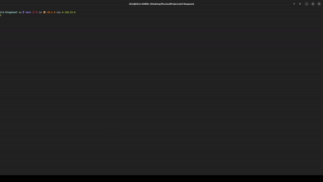

# Blogs-Nest

Blogs Nest is a command-line interface (CLI) application designed to help users navigate through articles and blogs from various blogging platforms effortlessly.

## Table of contents

- [Demo](#demo)
- [Getting Started](#getting-started)
- [Technologies](#technologies-used)
- [License](#license)
- [Contact](#contact)

## Demo

<p align="center">
	<br>
	
	<br>
</p>

## Getting Started

#### Prerequisites

- [Node.js](https://nodejs.org/) >=18.0
- [NPM](https://www.npmjs.com/)

### Try it now

Run

```
npx cli-blogsnest
```

### Local

#### Installation

1. Clone the repository:

```
git clone git@github.com:IdrisGit/cli-blogsnest.git
```

2. Navigate to the project directory:

```
cd cli-blogsnest
```

3. Install dependencies:

```
npm install
```

#### Usage

```
node index.js
```

## Technologies Used

- JavaScript
- Node.js
- [Inquirer.js](https://github.com/SBoudrias/Inquirer.js)
- [Nano Spinner](https://github.com/usmanyunusov/nanospinner)
- [Open](https://github.com/sindresorhus/open)

## License

Blogs Nest is licensed under the [MIT License](LICENSE.md).

## Contact

If you have any questions, suggestions, or feedback, please feel free to contact me.

Email: idris.gadi01@gmail.com  
GitHub: https://github.com/IdrisGit

Thank you for using Blogs Nest!
